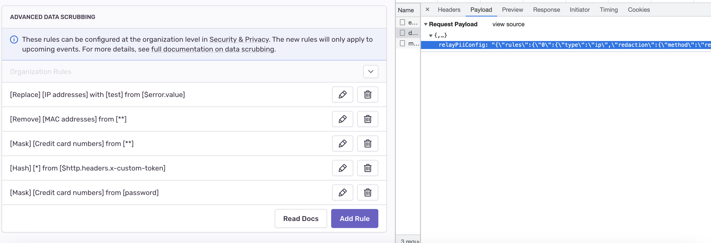
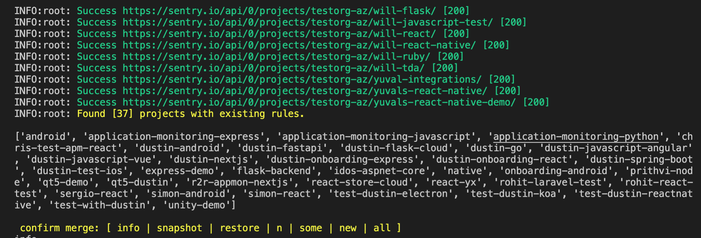

## Creating advanced data scrubbing rules:


### Getting started
---


 ```c
git clone <repository>

python3 -m venv myvenv
source myvenv/bin/activate

pip3 install -r requirements.txt

# Make sure to update config.yaml before running script below:

python3 create_rule.py
```

### Configuration
---

Example configuration with fake rules in expected format:

```c
config.yaml
---

rules: "{\"rules\":{\"0\":{\"type\":\"ip\",\"redaction\":{\"method\":\"replace\",\"text\":\"test\"}},\"1\":{\"type\":\"mac\",\"redaction\":{\"method\":\"remove\"}},\"2\":{\"type\":\"pattern\",\"pattern\":\"*\",\"redaction\":{\"method\":\"hash\"}},\"3\":{\"type\":\"creditcard\",\"redaction\":{\"method\":\"mask\"}}},\"applications\":{\"$error.value\":[\"0\"],\"**\":[\"1\",\"3\"],\"$http.headers.x-custom-token\":[\"2\"]}}"

auth: "<org:read project:read & write>"

org_slug: "<my_org_slug>"
```

### Adding Rules:
---

1. Create an internal integration token with min permissions (org:read, project:read & write). Add to `"<auth_token>"` in config. 
2. In your sample project navigate to: `https://{my_org}.sentry.io/settings/projects/{project_slug}/security-and-privacy/`
3. Open network tab and add desired rules in UI. It may be best to create a new project to preserve these for future additions.
4. Capture for payload for put PUT :
5. Paste payload into rules section of `config.yaml`. See example above.
6. Complete `config.yaml` with org slug.
7. Run `python3 create_rule.py` to fetch project rule data.
8. Select `snapshot` option from prompt to archive current project rules within org. This can be used to restore if needed.
9. Proceed to update `all`, `some`, or `new` projects with rules specified in `config.yaml`.

### Rules FAQ
---

By default Sentry APIs update project scrubbing rules in a fashion that makes additions all or nothing. So there are some considerations when it comes to overwriting existing project rules.

1. **Can I set a baseline of rules for all projects?**  ` Yes`
    - Since rules are updated in an all or nothing fashion, this script will merge existing project rules with the new rules you specify and dedupe.
    - This avoids overwritting pre-existing rules. 
    - Project members acting after the script's first run  to *delete* top down programmatic rules will lose these their changes on subsequent script runs across entire org. Their *additions* are maintained.

2. **Can I set a baseline of rules just for new projects?** `Yes`
    - Yes, this will only apply rules to projects that have never received additions. This will not apply rules to projects that have been reset using the deletion format: `"{\"rules\":{},\"applications\":{}}"`
    - If you wish to automate this process you can call `python3 create_rule.py --new`. 
3. **Can I get a preview of what to expect?**
    - By default, the script will fetch all project data. It will then ask if you want to update  projects based on rules specified in config.yaml. Options available:
    
    - `info` - Provides project slugs and rules found for org.
    - `snapshot` - Takes a snapshot of the current rule states for projects in an org.
    - `all` - Apply rules to all projects found.
    - `some` - Specify `project_slug(s)` for a smaller batch run before larger org.
    - `new` - Apply rules to projects that DON'T have existing rules and have never been reset with the deletion format.
    - `restore` - Apply changes from the previous run or from a snapshot. This will pull from `database.json` unless snapshot file name specified.
    - `n (no)`   
4. **Can I reset a project's scrubbing rule state?**
    - The script stores org rule state in `database.json` for only the previous run. File will be created on first run and overwritten on subsequent runs. Read more on `restore` in **section 3**.
    - You can provide the deletion format `"{\"rules\":{}},\"applications\":{}}"` as a `rule:` value in `config.yaml` remove all rules from a project. The script will prompt you to manually confirm deletions.
5. **How do I add additional rules once I've run the script across all of my projects?**
    - See [Add rules](#Adding-Rules) above.
    - Note that running the script more than once can cause new rules to be added to projects that have alread deleted said rules.

6. Certificates issues: `Install Certificates.command` in Python version Applicaitons folder (Mac) 